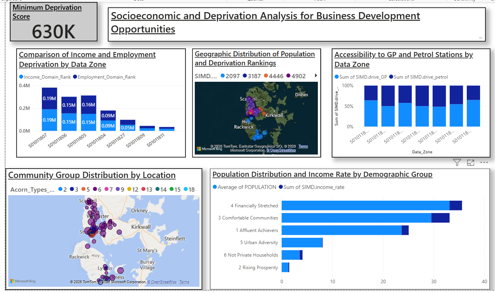
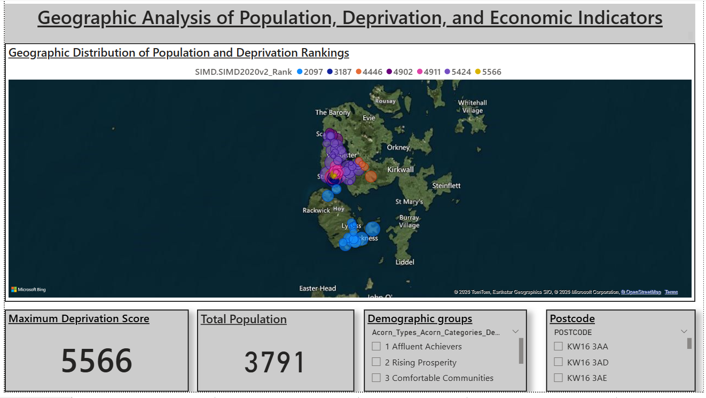
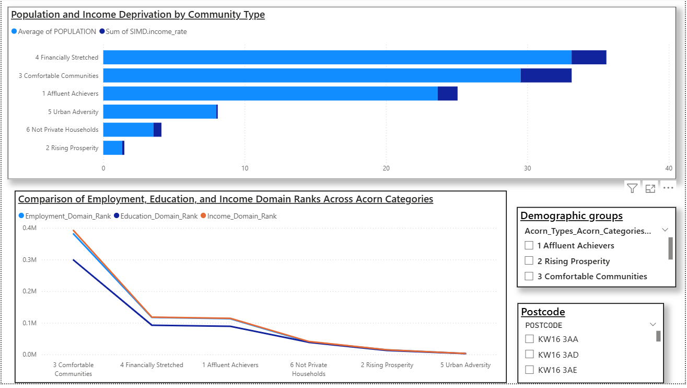
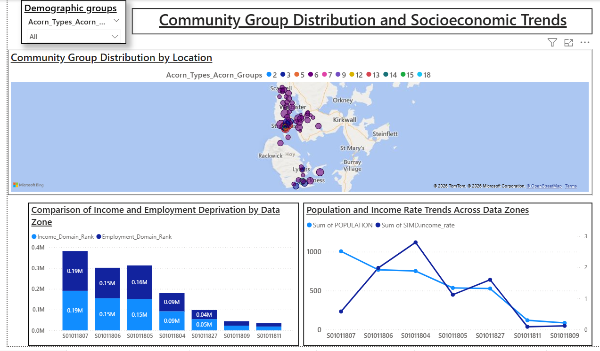
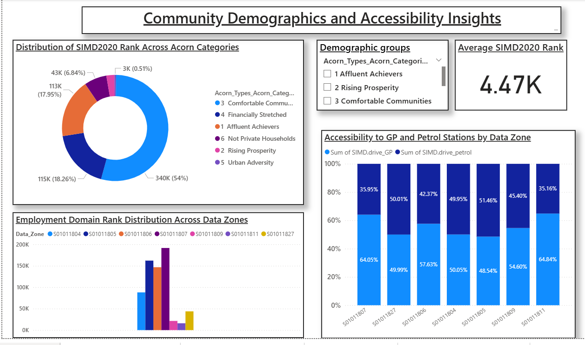

# Socioeconomic and Deprivation Analysis – Orkney Islands Council

## Overview
This Power BI project was developed during my internship with **Orkney Islands Council** to analyse
socioeconomic conditions, deprivation levels, population distribution, and accessibility to essential services
across Orkney data zones.

The dashboard supports data-driven decision-making for policy development, community planning,
and identification of priority areas for intervention.

---

## Project Objectives
- Analyse geographic patterns of population and deprivation
- Compare income, employment, and education deprivation across data zones
- Segment communities using ACORN demographic classifications
- Assess accessibility to essential services such as GP practices and petrol stations
- Provide an overall summary view to support strategic decision-making

---

## Key Insights
- Certain data zones consistently exhibit higher income and employment deprivation
- Financially Stretched and Comfortable Communities represent the largest population segments
- Income and employment deprivation trends vary significantly across community types
- Geographic clustering highlights areas with compounded socioeconomic challenges
- Accessibility to essential services differs across locations, indicating potential service gaps
- The overall summary dashboard identifies high-priority zones for targeted policy action

---

## Dashboard Structure

### 1. Overall Summary Dashboard
A consolidated view combining key socioeconomic indicators, deprivation metrics,
population distribution, and accessibility insights to support high-level decision-making.

### 2. Geographic Analysis – Overview
- Geographic distribution of population and deprivation rankings
- Identification of spatial clusters with higher deprivation scores
- Total population and maximum deprivation indicators

### 3. Geographic Analysis – Deep Dive
- Community group distribution by location
- Detailed analysis of income and employment deprivation by data zone
- Population and income trends across geographic areas

### 4. Asset and Gap Analysis
- Comparison of income and employment deprivation across data zones
- Identification of disparities and service gaps
- Trend analysis to support resource allocation planning

### 5. Sustainable Business Development
- Community demographics and deprivation distribution
- Accessibility analysis for GP practices and petrol stations
- Employment domain rank distribution across data zones
- Insights to support long-term socioeconomic development strategies

---

## Tools & Technologies
- Power BI
- Microsoft Excel
- Bing Maps (Power BI Map Visuals)

---

## Data Disclaimer
The data used in this project is anonymised and/or publicly available.
The analysis was conducted strictly for educational and internship purposes
and does not represent official policy decisions.

---

## Dashboard Preview

### Overall Summary Dashboard

### Geographic Analysis – Overview

### Geographic Analysis – Deep Dive

### Asset and Gap Analysis

### Sustainable Business Development

